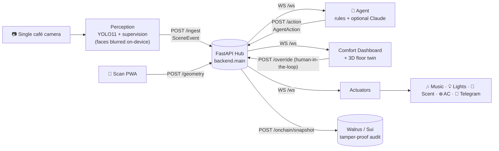

# ☕ Golden Coffee

### *Your café, but it runs itself.*

**One camera you already own → privacy-first computer vision → an AI agent that actually
acts** — tuning the atmosphere (music, lighting, scent, temperature) and protecting
speed-of-service (queue alerts, table service), with a live **Comfort Index**. No faces
stored. No surge pricing. Every action helps a guest or a staff member.

<p>
<a href="https://golden-coffee-production.up.railway.app"></a>
<a href="https://golden-coffee-production.up.railway.app/scan/"></a>
</p>

<p>
<a href="../../actions/workflows/ci.yml"></a>


</p>

> **What it is:** an *ambient autopilot + rush copilot* for cafés and restaurants. It reads
> the room from a single existing camera and takes real, gentle actions to make guests
> comfortable and keep service fast.
>
> **Why it matters:** café owners already have cameras nobody watches, queues that quietly
> lose sales, and a vibe that drives (or kills) dwell time. Golden Coffee turns that one
> camera into a teammate that handles the room so the owner can run the shop.

---

## ⏱️ The 60-second story

**The problem.** Cameras nobody watches. A queue of five costs you the sale of the sixth
person who walks out. The "feel" of the room — music too loud, air too stuffy, lights too
harsh — decides whether people stay for a second coffee. Nobody is watching all of it, all
the time.

**What Golden Coffee does.** It plugs into the camera you already own and understands the
room — occupancy, queue length, the conversion funnel, per-table wait times, cleaning
cadence. Then an agent *acts*:

- 🎶 **Softens the music** when the room is full so it stays talkable; **lifts the vibe**
  in a lull.
- ❄️ **Cools a busy, warming room** for comfort; warms and dims it for a cosy evening.
- 🌿 Freshens the air with **scent** when it gets stuffy.
- 🚨 **Alerts staff** — "queue at 6, open a second till" — *before* you lose the sale.
- 🍽️ Flags **tables waiting too long** to order, be cleared, or get the bill.
- 🏷️ Marks down **perishables** in a sustained lull (prices only ever go *down* — never a surge).

**The privacy stance.** Faces are blurred on-device before anything is processed. Tracking
uses ephemeral ByteTrack IDs — never a person's identity. No demographics, no employee
scoring, no using discomfort to move people along. A hardened `--privacy-mode` strips
bounding boxes entirely and adds differential-privacy noise to the heatmap.

**UK Sovereign AI — Flock.io federated learning.** Every venue runs `CaféComfortNet`,
a tiny policy model (8→16→8→4, ~500 parameters) that learns which ambient adjustments
improve guest experience from live scene data. Crucially, it trains *collectively* across
the café network without any venue ever sharing raw data:

```
Each café                              Flock.io aggregator
────────────────────────────────────   ─────────────────────────────
SceneEvents → local training           Receives: noisy gradient delta
Gradient clipped to L2 norm 1.0        Runs:     FedAvg across all nodes
+ Gaussian noise (DP-SGD)              Returns:  improved global model
────────────────────────────────────   ─────────────────────────────
Only a sanitised gradient vector       Never sees: video, tracks, counts
crosses the network                    Mathematical (ε,δ)-DP guarantee
```

A new café opening on any UK high street immediately inherits the collective
intelligence of every café that came before — without those cafés giving up
a single customer record. British businesses, British data, British AI.

```bash
python -m federated.fl_node          # train + contribute to Flock.io
python -m federated.server           # local aggregation server (dev/demo)
python -m federated.sim              # offline simulation: 3 cafés, 5 rounds
```

---

## 🔗 Live demo

| | Link |
|---|---|
| **Comfort dashboard** (live tiles, action feed, Comfort Index, 3D floor twin) | <https://golden-coffee-production.up.railway.app> |
| **Zero-setup demo** (self-contained, runs in the browser — no backend) | <https://lukataylo.github.io/Golden-Coffee/?demo=1> |
| **Floorplan scanner PWA** (pick a layout or scan your own → 3D twin) | <https://golden-coffee-production.up.railway.app/scan/> |

No backend handy? The dashboard has a self-contained **▶ Demo** mode
(`?demo=1`) that drives every tile from a synthetic café with zero setup — the
£-at-risk chip climbs, conversion updates, the 3D twin retunes, the feed narrates.

> **The GitHub Pages URL above** auto-publishes the demo from `.github/workflows/pages.yml`.
> It needs Pages enabled once — **Settings → Pages → Source = "GitHub Actions"** (one click,
> no token; the Actions token can't enable Pages itself) — then it deploys on every push to `main`.

### 🔑 Demo accounts (sample coffee shops)

The live **dashboard above is open — no login required**. For the customer-facing
web app (`web/`, sign-up + onboarding), these demo logins each load one of our 5
sample coffee-shop layouts. Password for all: **`GoldenDemo!24`**. Seed data lives
in [`web/seed/demo-accounts.json`](web/seed/demo-accounts.json).

| Login | Coffee shop | Sample room |
|---|---|---|
| `corner@goldencoffee.demo` | **Corner Café** | cosy · 4 tables · comfort 92 · 12 covers |
| `roastery@goldencoffee.demo` | **Open Roastery** | open-plan + patio · 6 tables · buzzy · 38 covers |
| `kiosk@goldencoffee.demo` | **Grab & Go Kiosk** | counter-led · queue focus · 6 covers |
| `bistro@goldencoffee.demo` | **Bistro + Patio** | 5 tables + patio · calm · 24 covers |
| `espresso@goldencoffee.demo` | **Long Bar Espresso** | bar + stools · cosy · 9 covers |

> The web app uses **Clerk** auth — seed these users in the Clerk dashboard (or
> enable demo mode) to sign in. Each maps to a layout in `dashboard/scan/presets.js`.

---

## 🚀 Run it locally in 2 minutes

No camera, no model, no API key needed — the mock generator proves the whole pipe end to end.

```bash
# 0) setup
python3 -m venv .venv && source .venv/bin/activate
pip install -r requirements.txt
cp .env.example .env                  # all keys optional; blanks degrade gracefully

# 1) the realtime hub (serves the dashboard at / too)
uvicorn backend.main:app --reload --port 8000

# 2) mock scenes — a synthetic café, no camera/model required (separate terminal)
python -m shared.mock_events

# 3) the agent — deterministic policy, no API key needed (separate terminal)
python -m agent.agent

# 4) open the dashboard
open http://127.0.0.1:8000        # live tiles, action feed, Comfort Index, 3D twin
```

Want the real thing? Each piece runs independently against the same two contracts:

```bash
python -m perception.run --source 0      # real YOLO11 + supervision events (+ MJPEG /stream)
python -m actuators.run                  # drive real devices (Spotify / Hue / IR AC / scent / Telegram)
```

📚 Full setup, devices, and the Telegram bot: **[docs/local-setup.md](docs/local-setup.md)**.

### ✅ Verify it yourself (no GPU, camera, or keys)

Everything offline is tested and runs in CI on every push ([.github/workflows/ci.yml](.github/workflows/ci.yml)):

```bash
pip install -r requirements-dev.txt        # lean test deps (every heavy CV import is lazy)
python -m pytest backend federated shared agent codeplain -q   # 59 unit tests: auth, command bar,
                                            # comfort index, forecast, discounts, FLock packaging, ops-report
python -m eval.capabilities_eval            # 106 deep behavioural checks — policy, music model,
                                            # agent, schemas, actuators, geometry, federation
python -m agent.policy                       # offline policy self-test over synthetic scenes
python -m federated.flock_model             # the FLock port: 3 venues train → aggregate → evaluate
```

---

## 🧠 How it works

Everything talks in exactly **two shapes** — a `SceneEvent` (what the camera understands)
and an `AgentAction` (what the system does) — defined in
[`shared/schemas.py`](shared/schemas.py). That single contract is what lets perception, the
agent, the backend, and the dashboard all run independently against a mock before any real
camera exists.



### Component map

| Component | Path | Role |
|---|---|---|
| **Perception** | `perception/` | YOLO11 + supervision (ByteTrack, polygon zones, dwell, funnel, heatmap, tables, cleaning). On-device face blur. Emits `SceneEvent`s. |
| **Agent** | `agent/` | Deterministic comfort + rush + table/cleaning policy; on-device music model; footfall forecast; optional Claude tool-use. Emits `AgentAction`s. |
| **Backend hub** | `backend/` | FastAPI WebSocket fan-out + REST. Decouples producers from consumers; replays state to new clients; MJPEG stream. |
| **Actuators** | `actuators/` | Subscribes to `/ws` and drives real devices: Spotify, Philips Hue, Broadlink IR (AC/heater), scent diffuser, Telegram. |
| **Dashboard** | `dashboard/` | Single-file comfort dashboard — Live / Floorplan / Tables, action feed, Comfort Index, Three.js 3D twin. No build step. |
| **Scan PWA** | `dashboard/scan/` | Installable PWA: pick a coffee-shop preset or trace your own floorplan → 3D twin → push geometry to live. |
| **Federated** | `federated/` | Cross-café learning (occupancy thresholds + music model) that shares only ratios/weights, never video. FLock port. |
| **On-chain** | `onchain/` | Anchors the anonymized metrics + agent action audit trail to Walrus (Sui ecosystem). |
| **Web** | `web/` | Separate Next.js + Clerk marketing/auth/onboarding app, deploys independently to Vercel. |

📐 Deeper architecture, the contract fields, and the endpoint list: **[docs/architecture.md](docs/architecture.md)**.

---

## ✨ Feature highlights

| Feature | What it does |
|---|---|
| 🌡️ **Comfort Index** | A live 0–100 read of how the room *feels* — blends music level, lighting, air/temperature and scent into one number ("Feels great"). |
| 🎛️ **Ambient autopilot** | Tunes music **volume + mood**, **lighting** (brightness + warmth), **scent**, and **temperature** to the room and time of day. The thermal model layers seasonal baseline → occupancy load → humidity → a warm-ambiance psychological offset, with hysteresis so it never thrashes the AC. |
| 🎵 **On-device music model** | A small softmax classifier picks the *mood/genre + BPM + playlist* from anonymized scene features — no API key, runs offline. Auto mode (model picks) or Custom mode (staff picks). See [MUSIC.md](MUSIC.md). |
| 🚨 **Rush copilot** | Queue over threshold → "open a second till." Escalates to **urgent** when walk-offs are rising, and surfaces the **£ walked away** today (avg ticket × abandons). |
| 💷 **Revenue-at-risk + funnel** | A live **"£ walked away today"** hero chip, a visual **conversion funnel** (came-in → ordered → walked-off), and a **"Today so far"** owner's digest — also served headless at `GET /ops/report`. |
| 🔊 **Audible autopilot** | In Auto mode the agent drives the **real in-browser audio** — the hosted music *audibly* softens when the room fills and switches vibe on a mood change. No hardware needed. |
| 🍽️ **Table service SLAs** | Per-table waits: dirty-table hygiene (≥3 min), order-taking (≥6 min), bill request (≥4 min), plus a generic overdue catch-all. |
| 🧽 **Cleaning cadence** | Tracks bussing + zone cleaning (e.g. restroom) by **usage *and* elapsed time**, alerting when overdue. |
| 🏷️ **Quiet-period markdown** | After a sustained lull, marks down perishables on the menu board — `never_surge` enforced per item; resets when the room fills. |
| 📈 **Footfall forecast** | Simple time-series over occupancy → a next-hour staffing heads-up. |
| 📱 **Scan-to-3D** | PWA: pick one of five café layouts (Corner Café, Open Roastery, Grab & Go Kiosk, Bistro + Patio, Long Bar Espresso) or trace your own floorplan photo → live 3D twin → push geometry to the cameras. |
| 🌐 **Federated learning** | Cafés tune each other's thresholds *and* music model without sharing a single frame — only capacity-normalized ratios and model weights leave a venue. |
| 📲 **Telegram alerts** | Staff get the urgent stuff (queue, overdue tables) pushed to their phones. |
| ⛓️ **Tamper-proof audit** | A one-click header button anchors the anonymized metrics + the agent's action log to **Walrus** and opens the **public, verifiable record** — an independently checkable log of what the AI did. |

### 📊 Accuracy, honestly

We benchmarked the perception pipeline against a vision-LLM judge on 24 frames across 4 clips
([`eval/report.md`](eval/report.md)):

- **On café-representative footage** (eye-level, sparse — the regime our single camera actually
  operates in): **count MAE ≈ 0.17, 100% within ±1.** ✅
- On deliberate stress cases (dense aerial plazas, crowds) `yolo11n` under-detects badly — which
  is why the *overall* MAE is high. Those scenes are nothing like a café camera; the fix
  (yolo11m/x, SAHI tiling, real zone geometry) is documented, not hidden.

📋 Feature-by-feature detail: **[docs/features.md](docs/features.md)**.

---

## 🏆 Hackathon tracks & bounties

| Bounty | Status | How it's integrated |
|---|---|---|
| **Sui / Walrus** | 🟢 **Live** | `onchain/walrus.py` + `POST /onchain/snapshot` anchor anonymized metrics + the agent's action audit trail to the Walrus testnet over pure HTTP — returns a public, verifiable blob URL. No wallet needed. |
| **Vercel** | 🟢 **Live-ready** | A separate production Next.js 14 + Clerk app in `web/` (marketing, auth, multi-venue onboarding) deploys independently to Vercel; the static dashboard is also Vercel-deployable and `?ws=`-aware. See [VERCEL.md](VERCEL.md). |
| **FLock** | 🟡 **Model ported; container CI-verified** | `federated/flock_model.py` is a faithful port of our federated sim onto FLock's `FlockModel` interface (`train`/`aggregate`/`evaluate`). `python -m federated.flock_model` runs end-to-end locally, and `Dockerfile.flock` is packaging-tested in CI (`federated/test_flock_packaging.py` rebuilds the image's copy-set and trains from it). Only the on-chain registration (IPFS/FlockTask, needs platform creds) remains — see [federated/FLOCK.md](federated/FLOCK.md). |
| **Codeplain** | 🟡 **Spec validated + feature live; render blocked on key** | The daily ops-report is specified spec-first in `codeplain/ops_report.plain`; a reference impl (`codeplain/ops_report.py`) passes the spec's acceptance tests in CI and is served live at `GET /ops/report`. The Codeplain-*rendered* deliverable still needs an API key — honest scope in [codeplain/README.md](codeplain/README.md). |

🔎 Full per-bounty write-up: **[docs/bounties.md](docs/bounties.md)**.

---

## 🛠️ Tech stack

- **Perception** — Ultralytics **YOLO11** + roboflow **supervision** (ByteTrack, polygon zones,
  heatmaps), OpenCV, MediaPipe face blur. *(Note: Ultralytics is AGPL-3.0 — fine for the
  hackathon; a permissive detector is the production swap.)*
- **Backend** — **FastAPI** + WebSockets + Uvicorn, Pydantic contracts. Dockerized, deployed on **Railway**.
- **Agent** — deterministic Python policy (no key needed) + optional **Claude** tool-use; on-device softmax music model.
- **Dashboard** — vanilla JS single file + **Three.js** (vendored, offline). PWA scanner with service worker + manifest.
- **Web** — **Next.js 14** (App Router) + TypeScript + Tailwind + **Clerk**, on **Vercel**.
- **Integrations** — Spotify, Philips Hue, Broadlink RM4 (IR), scent diffuser, Telegram, **Walrus** (Sui), **FLock**.

### Repo map

```
backend/      FastAPI WebSocket hub + REST (deployed)
perception/   YOLO11 + supervision → SceneEvents; zone/geometry tools
agent/        policy + music model + forecast + Claude path
actuators/    device executors (music/lights/IR/scent/telegram)
dashboard/    comfort dashboard (+ 3D twin) and scan/ PWA
federated/    cross-café learning + FLock port
onchain/      Walrus anchoring
shared/       schemas.py (the contract) + mock_events.py
eval/         perception accuracy harness + report
web/          Next.js + Clerk marketing/auth/onboarding (Vercel)
docs/         📖 this project's wiki
```

---

## 📖 Docs wiki

| Page | What's inside |
|---|---|
| [docs/architecture.md](docs/architecture.md) | Data flow, the `SceneEvent` + `AgentAction` contracts, every endpoint. |
| [docs/features.md](docs/features.md) | Every feature explained: comfort autopilot, rush copilot, tables/cleaning, scan PWA, federated. |
| [PITCH.md](PITCH.md) | **The 3-minute pitch — single source of truth:** one-liner, the hero moment, proof points, run-of-show checklist, and the focus discipline. |
| [docs/demo-guide.md](docs/demo-guide.md) | A tight 3-minute run-of-show for judges + the hero moment. |
| [docs/privacy.md](docs/privacy.md) | The privacy-first stance — exactly what is and isn't stored. |
| [docs/bounties.md](docs/bounties.md) | Each sponsor track and how we integrated it. |
| [docs/local-setup.md](docs/local-setup.md) | Full local run, env vars, and devices. |

Reference docs: [TRACKS.md](TRACKS.md) · [RESEARCH.md](RESEARCH.md) · [FLOORMAP_RESEARCH.md](FLOORMAP_RESEARCH.md) · [MUSIC.md](MUSIC.md) · [DEPLOY.md](DEPLOY.md)

---

<sub>Built at the **Encode Vibe Coding Hackathon**. Golden Coffee is an ambient + ops copilot,
not a surveillance tool — no employee scoring, no demographics, no surge pricing, no using
discomfort to move people along.</sub>
