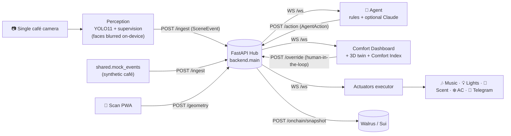

# 🧭 Architecture

Coffee Steve is deliberately small and decoupled. Four moving parts — perception, agent,
backend, and the dashboard — never talk to each other directly. They all talk to a central
**hub** in exactly **two shapes**: a `SceneEvent` (what the camera understands) and an
`AgentAction` (what the system does). That single contract is the whole trick: any part can
run, and be developed, against a mock with the others absent.

## Data flow

**Why a hub?** It decouples producers from consumers so all the workstreams run independently.
The hub also keeps the **last scene** and a **rolling action log** (the most recent 50), so a
freshly-connected dashboard or agent gets immediate state instead of a blank screen — and the
current music mode is replayed too.

## The contracts (`shared/schemas.py`)

### `SceneEvent` — perception → everyone

One event per processed tick (~1–2 Hz is plenty). Key fields:

| Field | Meaning |
|---|---|
| `ts` | producer-stamped unix seconds |
| `tracks[]` | per-person `Track`: ephemeral `id` (ByteTrack, **not** an identity), `role`, `zone`, `dwell_s`, `activity`, optional normalized `bbox` (faces already blurred upstream) |
| `occupancy`, `queue_len` | live counts |
| `funnel` | `entered → approached → ordered → seated`, plus `abandoned` (left the queue) |
| `cups_made` | cumulative drinks detected at the counter |
| `heatmap_grid` | coarse dwell-density grid for flow/layout |
| `staff_productivity` | 0–1 aggregate room movement/energy (anonymized) |
| `tables[]` | per-table `occupied`, `party_size`, `wait_s`, `status` (`empty`/`seated`/`waiting`/`waiting_to_order`/`overdue`/`requested_bill`), plus cleaning state |
| `cleaning[]` | per-zone cadence: `uses_since_clean`, `since_clean_s`, `status` (`ok`/`due`/`overdue`) |
| `walkaway_gbp` | cumulative £ lost to queue walk-offs today |
| `forecast_next_hour` | predicted next-hour occupancy |
| `outdoor_temp_c`, `indoor_humidity_rh` | optional sensor inputs to the thermal model |
| `source` | `"mock"` or `"perception"` |

### `AgentAction` — agent → actuators + dashboard

| Field | Meaning |
|---|---|
| `action` | one of: `set_music_volume`, `set_music`, `set_temperature`, `set_lighting`, `set_scent`, `push_discount`, `notify_staff`, `suggest_layout`, `tune_policy`, `update_menu_price` |
| `params` | action-specific payload (e.g. `{"volume": 55}`, `{"target_c": 21.5}`) |
| `rationale` | plain-English "why", shown on the dashboard |
| `reversible` | whether it can be undone |
| `auto` | `False` when triggered by a human override |

A third message, `MusicModeEvent`, is broadcast when music switches between **auto** (the model
picks) and **custom** (staff picks) — in custom mode the agent suppresses its music actions.

## Backend endpoints (`backend/main.py`)

| Method · Path | Purpose |
|---|---|
| `GET /health` | liveness + client/scene/frame status |
| `POST /ingest` | producers push a `SceneEvent` (mock or perception); also appended to the metrics log |
| `POST /action` | the agent pushes an `AgentAction` |
| `POST /override` | dashboard buttons fire a human action (`auto=False`) |
| `WS /ws` | the broadcast socket — dashboards, actuators, and the agent subscribe |
| `POST /frame` · `GET /frame.jpg` · `GET /stream` | annotated camera frame ingest + single-frame + MJPEG stream |
| `GET /metrics` | recent metrics history + a small summary (for forecasting / the pitch) |
| `GET /geometry` · `POST /geometry` | active floorplan geometry (the scan PWA writes it; perception + dashboard read it) |
| `GET /music/mode` · `POST /music/mode` | read/toggle auto vs custom music mode |
| `POST /onchain/snapshot` | anchor anonymized metrics + the action audit trail to Walrus |
| `GET /` + static mount | serves the dashboard UI |

A `SceneEvent` arriving at `/ingest` is logged to `data/metrics.jsonl` (occupancy, queue, funnel,
waiting tables, overdue cleaning) so the footfall forecast and the on-chain snapshot have history.

## Deployment shape

- The **hub** (FastAPI WebSocket server, which also serves the dashboard at `/`) runs on a
  long-lived server — **Railway** in our case (Render/Fly also fine). It **cannot** run on Vercel
  serverless, which can't hold a socket open. It builds from the repo `Dockerfile` using the
  slim `requirements-backend.txt` (no torch/ultralytics).
- **Producers, the agent, and actuators** run on the demo laptop and point at the hub via
  `BACKEND_URL` / `BACKEND_WS`.
- The **`web/`** Next.js app and (optionally) the static dashboard deploy to **Vercel**, pointing
  at the Railway backend with a `?ws=wss://…` override.

See [DEPLOY.md](../DEPLOY.md) and [VERCEL.md](../VERCEL.md) for the exact commands.
